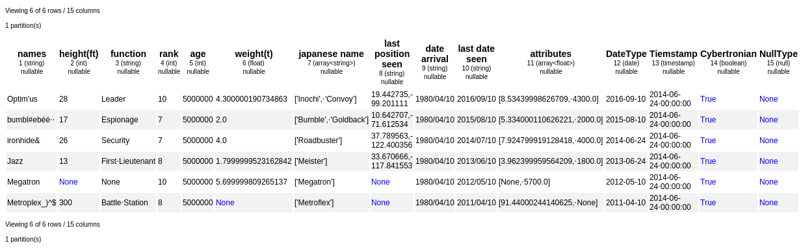

[](https://hi-optimus.com) 


[](https://badge.fury.io/py/pyoptimus) [](http://ironmussa.com) [](https://pyup.io/repos/github/hi-primus/optimus/)  [](https://github.com/hi-primus/optimus/) 
[](https://www.codacy.com/app/argenisleon/Optimus?utm_source=github.com&amp;utm_medium=referral&amp;utm_content=hi-primus/optimus&amp;utm_campaign=Badge_Grade)
[](https://coveralls.io/github/hi-primus/optimus?branch=develop-3.0) [](https://github.com/bulutyazilim/awesome-datascience) 

[](https://pepy.tech/project/pyoptimus)
[](https://pepy.tech/project/pyoptimus/month)
[](https://pepy.tech/project/pyoptimus/week)


To launch a live notebook server to test optimus using binder or Colab, click on one of the following badges:

[](https://mybinder.org/v2/gh/hi-primus/optimus/develop-3.0)
[](https://colab.research.google.com/github/hi-primus/optimus/blob/develop-3.0/examples/10_min_from_spark_to_pandas_with_optimus.ipynb)

Optimus is the missing framework to profile, clean, process and do ML in a distributed fashion using Apache Spark(PySpark).

## Installation (pip):  
  
In your terminal just type  ```pip install pyoptimus```

### Requirements
* Python>=3.6

## Examples 

You can go to the 10 minutes to Optimus [notebook](https://github.com/hi-primus/optimus/blob/develop-3.0/examples/10_min_from_pandas_to_spark_with_optimus.ipynb) where you can find the basic to start working. 

Also you can go to the [examples](examples/) folder to found specific notebooks about data cleaning, data munging, profiling, data enrichment and how to create ML and DL models.

Besides check the [Cheat Sheet](https://htmlpreview.github.io/?https://github.com/hi-primus/optimus/blob/develop-3.0/docs/cheatsheet/optimus_cheat_sheet.html) 
 
 
## Feedback 
Feedback is what drive Optimus future, so please take a couple of minutes to help shape the Optimus' Roadmap:  http://bit.ly/optimus_survey  

Also if you want to a suggestion or feature request use https://github.com/hi-primus/optimus/issues
 
## Start Optimus

Start Optimus using ```"pandas"```, ```"dask"```, ```"cudf"``` or ```"dask_cudf"```.

```python
from optimus import Optimus
op = Optimus("pandas")
```

## Loading data

Now Optimus can load data in csv, json, parquet, avro, excel from a local file or URL.

```python
#csv
df = op.load.csv("../examples/data/foo.csv")

#json
df = op.load.json("../examples/data/foo.json")

# using a url
df = op.load.json("https://raw.githubusercontent.com/hi-primus/optimus/develop-3.0/examples/data/foo.json")

# parquet
df = op.load.parquet("../examples/data/foo.parquet")

# ...or anything else
df = op.load.file("../examples/data/titanic3.xls")
```

Also, you can load data from oracle, redshift, mysql and postgres.

## Saving Data

```python
#csv
df.save.csv("data/foo.csv")

# json
df.save.json("data/foo.json")

# parquet
df.save.parquet("data/foo.parquet")
```

You can also save data to oracle, redshift, mysql and postgres.

## Create dataframes

Also, you can create a dataframe from scratch
```python
df = op.create.dataframe({
    'A': ['a', 'b', 'c', 'd'],
    'B': [1, 3, 5, 7],
    'C': [2, 4, 6, None],
    'D': ['1980/04/10', '1980/04/10', '1980/04/10', '1980/04/10']
})
```

Using `display` you have a beautiful way to show your data with extra information like column number, column data type and marked white spaces.

```python
display(df)
```


## Cleaning and Processing
  
Optimus was created to make data cleaning a breeze. The API was designed to be super easy to newcomers and very familiar for people that comes from Pandas.
Optimus expands the standard DataFrame functionality adding `.rows` and `.cols` accessors.

For example you can load data from a url, transform and apply some predefined cleaning functions:

```python
new_df = df\
    .rows.sort("rank", "desc")\
    .cols.lower(["names", "function"])\
    .cols.date_format("date arrival", "yyyy/MM/dd", "dd-MM-YYYY")\
    .cols.years_between("date arrival", "dd-MM-YYYY", output_cols="from arrival")\
    .cols.remove_accents("names")\
    .cols.remove_special_chars("names")\
    .rows.drop(df["rank"]>8)\
    .cols.rename("*", str.lower)\
    .cols.trim("*")\
    .cols.unnest("japanese name", output_cols="other names")\
    .cols.unnest("last position seen", separator=",", output_cols="pos")\
    .cols.drop(["last position seen", "japanese name", "date arrival", "cybertronian", "nulltype"])
```

## Troubleshooting

```
ImportError: failed to find libmagic.  Check your installation
```
Install libmagic
https://anaconda.org/conda-forge/libmagic

## Contributing to Optimus

Contributions go far beyond pull requests and commits. We are very happy to receive any kind of contributions   
including:  
  
* [Documentation](https://github.com/hi-primus/optimus/tree/develop-3.0/docs/source) updates, enhancements, designs, or   bugfixes.  
* Spelling or grammar fixes.  
* README.md corrections or redesigns.  
* Adding unit, or functional [tests](https://github.com/hi-primus/optimus/tree/develop-3.0/tests)   
* Triaging GitHub issues -- especially determining whether an issue still persists or is reproducible.  
* [Searching #optimusdata on twitter](https://twitter.com/search?q=optimusdata) and helping someone else who needs help.  
* [Blogging, speaking about, or creating tutorials](https://hioptimus.com/category/blog/)   about Optimus and its many features.  
* Helping others on [Discord](https://img.shields.io/discord/579030865468719104.svg)    
  
## Backers 

[[Become a backer](https://opencollective.com/optimus#backer)] and get your image on our README on Github with a link to your site.  
[](#backers)   


## Sponsors 

[[Become a sponsor](https://opencollective.com/optimus#backer)] and get your image on our README on Github with a link to your site.  
[](#sponsors)  
  
## Core Team

Argenis Leon and Luis Aguirre

## Contributors

Here is the amazing people that make Optimus possible:
  
https://github.com/hi-primus/optimus/graphs/contributors

## License  
  
Apache 2.0 © [Primus](https://github.com/hi-primus)  
  
[](https://ironmussa.com)  

[](https://twitter.com/hi_optimus)
