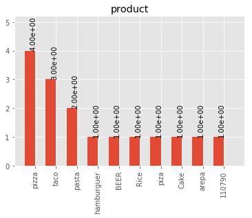
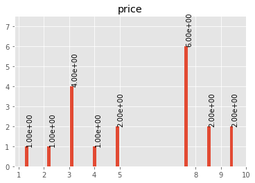

Analyzing your Data
====================

DataFrameProfiler class
-----------------------

This class makes a profile for a given dataframe and its different general features.
Based on spark-df-profiling by Julio Soto.

Initially it is a good idea to see a general view of the DataFrame to be analyzed.

Lets assume you have the following dataset, called foo.csv, in your current directory:

+----+----------------------+-------------+-----------+------------+-------+------------+----------+
| id | firstName            | lastName    | billingId | product    | price | birth      | dummyCol |
+----+----------------------+-------------+-----------+------------+-------+------------+----------+
| 1  | Luis                 | Alvarez$$%! | 123       | Cake       | 10    | 1980/07/07 | never    |
+----+----------------------+-------------+-----------+------------+-------+------------+----------+
| 2  | André                | Ampère      | 423       | piza       | 8     | 1950/07/08 | gonna    |
+----+----------------------+-------------+-----------+------------+-------+------------+----------+
| 3  | NiELS                | Böhr//((%%  | 551       | pizza      | 8     | 1990/07/09 | give     |
+----+----------------------+-------------+-----------+------------+-------+------------+----------+
| 4  | PAUL                 | dirac$      | 521       | pizza      | 8     | 1954/07/10 | you      |
+----+----------------------+-------------+-----------+------------+-------+------------+----------+
| 5  | Albert               | Einstein    | 634       | pizza      | 8     | 1990/07/11 | up       |
+----+----------------------+-------------+-----------+------------+-------+------------+----------+
| 6  | Galileo              | GALiLEI     | 672       | arepa      | 5     | 1930/08/12 | never    |
+----+----------------------+-------------+-----------+------------+-------+------------+----------+
| 7  | CaRL                 | Ga%%%uss    | 323       | taco       | 3     | 1970/07/13 | gonna    |
+----+----------------------+-------------+-----------+------------+-------+------------+----------+
| 8  | David                | H$$$ilbert  | 624       | taaaccoo   | 3     | 1950/07/14 | let      |
+----+----------------------+-------------+-----------+------------+-------+------------+----------+
| 9  | Johannes             | KEPLER      | 735       | taco       | 3     | 1920/04/22 | you      |
+----+----------------------+-------------+-----------+------------+-------+------------+----------+
| 10 | JaMES                | M$$ax%%well | 875       | taco       | 3     | 1923/03/12 | down     |
+----+----------------------+-------------+-----------+------------+-------+------------+----------+
| 11 | Isaac                | Newton      | 992       | pasta      | 9     | 1999/02/15 | never    |
+----+----------------------+-------------+-----------+------------+-------+------------+----------+
| 12 | Emmy%%               | Nöether$    | 234       | pasta      | 9     | 1993/12/08 | gonna    |
+----+----------------------+-------------+-----------+------------+-------+------------+----------+
| 13 | Max!!!               | Planck!!!   | 111       | hamburguer | 4     | 1994/01/04 | run      |
+----+----------------------+-------------+-----------+------------+-------+------------+----------+
| 14 | Fred                 | Hoy&&&le    | 553       | pizzza     | 8     | 1997/06/27 | around   |
+----+----------------------+-------------+-----------+------------+-------+------------+----------+
| 15 | (((   Heinrich ))))) | Hertz       | 116       | pizza      | 8     | 1956/11/30 | and      |
+----+----------------------+-------------+-----------+------------+-------+------------+----------+
| 16 | William              | Gilbert###  | 886       | BEER       | 2     | 1958/03/26 | desert   |
+----+----------------------+-------------+-----------+------------+-------+------------+----------+
| 17 | Marie                | CURIE       | 912       | Rice       | 1     | 2000/03/22 | you      |
+----+----------------------+-------------+-----------+------------+-------+------------+----------+
| 18 | Arthur               | COM%%%pton  | 812       | 110790     | 5     | 1899/01/01 | #        |
+----+----------------------+-------------+-----------+------------+-------+------------+----------+
| 19 | JAMES                | Chadwick    | 467       | null       | 10    | 1921/05/03 | #        |
+----+----------------------+-------------+-----------+------------+-------+------------+----------+

.. code:: python

    # Import optimus
    import optimus as op
    #Import os module for system tools
    import os

    # Reading dataframe. os.getcwd() returns de current directory of the notebook
    # 'file:///' is a prefix that specifies the type of file system used, in this
    # case, local file system (hard drive of the pc) is used.
    filePath = "file:///" + os.getcwd() + "/foo.csv"

    df = tools.read_csv(path=filePath,
                                sep=',')

    # Instance of profiler class
    profiler = op.DataFrameProfiler(df)
    profiler.profiler()

This overview presents basic information about the DataFrame, like number of variable it has,
how many are missing values and in which column, the types of each variable, also some statistical information
that describes the variable plus a frequency plot. table that specifies the existing datatypes in each column
dataFrame and other features. Also, for this particular case, the table of dataType is shown in order to visualize
a sample of column content.

DataFrameAnalyzer class
-----------------------

DataFrameAnalyzer class analyze dataType of rows in each columns of
dataFrames.

**DataFrameAnalyzer methods**

-  DataFrameAnalyzer.column_analyze(column_list, plots=True, values_bar=True, print_type=False, num_bars=10)
-  DataFrameAnalyzer.plot_hist(df_one_col, hist_dict, type_hist, num_bars=20, values_bar=True)
-  DataFrameAnalyzer.get_categorical_hist(df_one_col, num_bars)
-  DataFrameAnalyzer.get_numerical_hist(df_one_col, num_bars)
-  DataFrameAnalyzer.unique_values_col(column)
-  DataFrameAnalyzer.write_json(json_cols, path_to_json_file)
-  DataFrameAnalyzer.get_frequency(columns, sort_by_count=True)

Lets assume you have the following dataset, called foo.csv, in your current directory:

+----+----------------------+-------------+-----------+------------+-------+------------+----------+
| id | firstName            | lastName    | billingId | product    | price | birth      | dummyCol |
+----+----------------------+-------------+-----------+------------+-------+------------+----------+
| 1  | Luis                 | Alvarez$$%! | 123       | Cake       | 10    | 1980/07/07 | never    |
+----+----------------------+-------------+-----------+------------+-------+------------+----------+
| 2  | André                | Ampère      | 423       | piza       | 8     | 1950/07/08 | gonna    |
+----+----------------------+-------------+-----------+------------+-------+------------+----------+
| 3  | NiELS                | Böhr//((%%  | 551       | pizza      | 8     | 1990/07/09 | give     |
+----+----------------------+-------------+-----------+------------+-------+------------+----------+
| 4  | PAUL                 | dirac$      | 521       | pizza      | 8     | 1954/07/10 | you      |
+----+----------------------+-------------+-----------+------------+-------+------------+----------+
| 5  | Albert               | Einstein    | 634       | pizza      | 8     | 1990/07/11 | up       |
+----+----------------------+-------------+-----------+------------+-------+------------+----------+
| 6  | Galileo              | GALiLEI     | 672       | arepa      | 5     | 1930/08/12 | never    |
+----+----------------------+-------------+-----------+------------+-------+------------+----------+
| 7  | CaRL                 | Ga%%%uss    | 323       | taco       | 3     | 1970/07/13 | gonna    |
+----+----------------------+-------------+-----------+------------+-------+------------+----------+
| 8  | David                | H$$$ilbert  | 624       | taaaccoo   | 3     | 1950/07/14 | let      |
+----+----------------------+-------------+-----------+------------+-------+------------+----------+
| 9  | Johannes             | KEPLER      | 735       | taco       | 3     | 1920/04/22 | you      |
+----+----------------------+-------------+-----------+------------+-------+------------+----------+
| 10 | JaMES                | M$$ax%%well | 875       | taco       | 3     | 1923/03/12 | down     |
+----+----------------------+-------------+-----------+------------+-------+------------+----------+
| 11 | Isaac                | Newton      | 992       | pasta      | 9     | 1999/02/15 | never    |
+----+----------------------+-------------+-----------+------------+-------+------------+----------+
| 12 | Emmy%%               | Nöether$    | 234       | pasta      | 9     | 1993/12/08 | gonna    |
+----+----------------------+-------------+-----------+------------+-------+------------+----------+
| 13 | Max!!!               | Planck!!!   | 111       | hamburguer | 4     | 1994/01/04 | run      |
+----+----------------------+-------------+-----------+------------+-------+------------+----------+
| 14 | Fred                 | Hoy&&&le    | 553       | pizzza     | 8     | 1997/06/27 | around   |
+----+----------------------+-------------+-----------+------------+-------+------------+----------+
| 15 | (((   Heinrich ))))) | Hertz       | 116       | pizza      | 8     | 1956/11/30 | and      |
+----+----------------------+-------------+-----------+------------+-------+------------+----------+
| 16 | William              | Gilbert###  | 886       | BEER       | 2     | 1958/03/26 | desert   |
+----+----------------------+-------------+-----------+------------+-------+------------+----------+
| 17 | Marie                | CURIE       | 912       | Rice       | 1     | 2000/03/22 | you      |
+----+----------------------+-------------+-----------+------------+-------+------------+----------+
| 18 | Arthur               | COM%%%pton  | 812       | 110790     | 5     | 1899/01/01 | #        |
+----+----------------------+-------------+-----------+------------+-------+------------+----------+
| 19 | JAMES                | Chadwick    | 467       | null       | 10    | 1921/05/03 | #        |
+----+----------------------+-------------+-----------+------------+-------+------------+----------+

The following code shows how to instantiate the class to analyze a dataFrame:

.. code:: python

    # Import optimus
    import optimus as op
    # Instance of Utilities class
    tools = op.Utilities()

    # Reading dataframe. os.getcwd() returns de current directory of the notebook
    # 'file:///' is a prefix that specifies the type of file system used, in this
    # case, local file system (hard drive of the pc) is used.
    filePath = "file:///" + os.getcwd() + "/foo.csv"

    df = tools.read_csv(path=filePath, sep=',')

    analyzer = op.DataFrameAnalyzer(df=df,pathFile=filePath)

Analyzer.column_analyze(column_list, plots=True, values_bar=True, print_type=False, num_bars=10)
~~~~~~~~~~~~~~~~~~~~~~~~~~~~~~~~~~~~~~~~~~~~~~~~~~~~~~~~~~~~~~~~~~~~~~~~~~~~~~~~~~~~~~~~~~~~~~~~~~~

This function counts the number of registers in a column that are numbers (integers, floats) and the number of string registers.

Input:

``column_list``: A list or a string column name.

``plots``: Can be True or False. If true it will output the predefined plots.

``values_bar (optional)``: Can be True or False. If it is True, frequency values are placed over each bar.

``print_type (optional)``: Can be one of the following strings: 'integer', 'string', 'float'. Depending of what string
is provided, a list of distinct values of that type is printed.

``num_bars``: number of bars printed in histogram

The method outputs a list containing the number of the different datatypes [nulls, strings, integers, floats].

Example:

.. code:: python

  analyzer.column_analyze("*", plots=False, values_bar=True, print_type=False, num_bars=10)

+-----------+----------+------------+----------------------+
|           |          |            | Column name: id      |
+-----------+----------+------------+----------------------+
|           |          |            | Column datatype: int |
+-----------+----------+------------+----------------------+
| Datatype  | Quantity | Percentage |                      |
+-----------+----------+------------+----------------------+
| None      | 0        | 0.00 %     |                      |
+-----------+----------+------------+----------------------+
| Empty str | 0        | 0.00 %     |                      |
+-----------+----------+------------+----------------------+
| String    | 0        | 0.00 %     |                      |
+-----------+----------+------------+----------------------+
| Integer   | 19       | 100.00 %   |                      |
+-----------+----------+------------+----------------------+
| Float     | 0        | 0.00 %     |                      |
+-----------+----------+------------+----------------------+

Min value:  1

Max value:  19

end of __analyze 4.059180021286011

+-----------+----------+------------+-------------------------+
|           |          |            | Column name: firstName  |
+-----------+----------+------------+-------------------------+
|           |          |            | Column datatype: string |
+-----------+----------+------------+-------------------------+
| Datatype  | Quantity | Percentage |                         |
+-----------+----------+------------+-------------------------+
| None      | 0        | 0.00 %     |                         |
+-----------+----------+------------+-------------------------+
| Empty str | 0        | 0.00 %     |                         |
+-----------+----------+------------+-------------------------+
| String    | 19       | 100.00 %   |                         |
+-----------+----------+------------+-------------------------+
| Integer   | 0        | 0.00 %     |                         |
+-----------+----------+------------+-------------------------+
| Float     | 0        | 0.00 %     |                         |
+-----------+----------+------------+-------------------------+

end of __analyze 1.1431787014007568

+-----------+----------+------------+-------------------------+
|           |          |            | Column name: lastName   |
+-----------+----------+------------+-------------------------+
|           |          |            | Column datatype: string |
+-----------+----------+------------+-------------------------+
| Datatype  | Quantity | Percentage |                         |
+-----------+----------+------------+-------------------------+
| None      | 0        | 0.00 %     |                         |
+-----------+----------+------------+-------------------------+
| Empty str | 0        | 0.00 %     |                         |
+-----------+----------+------------+-------------------------+
| String    | 19       | 100.00 %   |                         |
+-----------+----------+------------+-------------------------+
| Integer   | 0        | 0.00 %     |                         |
+-----------+----------+------------+-------------------------+
| Float     | 0        | 0.00 %     |                         |
+-----------+----------+------------+-------------------------+

end of __analyze 0.9663524627685547

+-----------+----------+------------+------------------------+
|           |          |            | Column name: billingId |
+-----------+----------+------------+------------------------+
|           |          |            | Column datatype: int   |
+-----------+----------+------------+------------------------+
| Datatype  | Quantity | Percentage |                        |
+-----------+----------+------------+------------------------+
| None      | 0        | 0.00 %     |                        |
+-----------+----------+------------+------------------------+
| Empty str | 0        | 0.00 %     |                        |
+-----------+----------+------------+------------------------+
| String    | 0        | 0.00 %     |                        |
+-----------+----------+------------+------------------------+
| Integer   | 19       | 100.00 %   |                        |
+-----------+----------+------------+------------------------+
| Float     | 0        | 0.00 %     |                        |
+-----------+----------+------------+------------------------+

Min value:  111

Max value:  992

end of __analyze 4.292513847351074

+-----------+----------+------------+-------------------------+
|           |          |            | Column name: product    |
+-----------+----------+------------+-------------------------+
|           |          |            | Column datatype: string |
+-----------+----------+------------+-------------------------+
| Datatype  | Quantity | Percentage |                         |
+-----------+----------+------------+-------------------------+
| None      | 0        | 0.00 %     |                         |
+-----------+----------+------------+-------------------------+
| Empty str | 0        | 0.00 %     |                         |
+-----------+----------+------------+-------------------------+
| String    | 18       | 94.74 %    |                         |
+-----------+----------+------------+-------------------------+
| Integer   | 1        | 5.26 %     |                         |
+-----------+----------+------------+-------------------------+
| Float     | 0        | 0.00 %     |                         |
+-----------+----------+------------+-------------------------+

end of __analyze 1.180891990661621

+-----------+----------+------------+------------------------+
|           |          |            | Column name: price     |
+-----------+----------+------------+------------------------+
|           |          |            | Column datatype: int   |
+-----------+----------+------------+------------------------+
| Datatype  | Quantity | Percentage |                        |
+-----------+----------+------------+------------------------+
| None      | 0        | 0.00 %     |                        |
+-----------+----------+------------+------------------------+
| Empty str | 0        | 0.00 %     |                        |
+-----------+----------+------------+------------------------+
| String    | 0        | 0.00 %     |                        |
+-----------+----------+------------+------------------------+
| Integer   | 19       | 100.00 %   |                        |
+-----------+----------+------------+------------------------+
| Float     | 0        | 0.00 %     |                        |
+-----------+----------+------------+------------------------+

Min value:  1

Max value:  10

end of __analyze 4.364053964614868

+-----------+----------+------------+-------------------------+
|           |          |            | Column name: birth      |
+-----------+----------+------------+-------------------------+
|           |          |            | Column datatype: string |
+-----------+----------+------------+-------------------------+
| Datatype  | Quantity | Percentage |                         |
+-----------+----------+------------+-------------------------+
| None      | 0        | 0.00 %     |                         |
+-----------+----------+------------+-------------------------+
| Empty str | 0        | 0.00 %     |                         |
+-----------+----------+------------+-------------------------+
| String    | 19       | 100.00 %   |                         |
+-----------+----------+------------+-------------------------+
| Integer   | 0        | 0.00 %     |                         |
+-----------+----------+------------+-------------------------+
| Float     | 0        | 0.00 %     |                         |
+-----------+----------+------------+-------------------------+

end of __analyze 0.9144570827484131

+-----------+----------+------------+-------------------------+
|           |          |            | Column name: dummyCol   |
+-----------+----------+------------+-------------------------+
|           |          |            | Column datatype: string |
+-----------+----------+------------+-------------------------+
| Datatype  | Quantity | Percentage |                         |
+-----------+----------+------------+-------------------------+
| None      | 0        | 0.00 %     |                         |
+-----------+----------+------------+-------------------------+
| Empty str | 0        | 0.00 %     |                         |
+-----------+----------+------------+-------------------------+
| String    | 19       | 100.00 %   |                         |
+-----------+----------+------------+-------------------------+
| Integer   | 0        | 0.00 %     |                         |
+-----------+----------+------------+-------------------------+
| Float     | 0        | 0.00 %     |                         |
+-----------+----------+------------+-------------------------+

end of __analyze 0.9651758670806885

Total execution time:  17.98968768119812

+-----------+------------------+---------------------+
|           |                  | General Description |
+-----------+------------------+---------------------+
| Features  | Name or Quantity |                     |
+-----------+------------------+---------------------+
| File Name | foo.csv          |                     |
+-----------+------------------+---------------------+
| Columns   | 8                |                     |
+-----------+------------------+---------------------+
| Rows      | 19               |                     |
+-----------+------------------+---------------------+

Analyzer.get_categorical_hist(df_one_col, num_bars)
~~~~~~~~~~~~~~~~~~~~~~~~~~~~~~~~~~~~~~~~~~~~~~~~~~~~~~

This function analyzes a dataframe of a single column (only string type columns) and returns a dictionary with bins and values of frequency.

Input:

``df_one_col``:One column dataFrame.

``num_bars``: Number of bars or histogram bins.

The method outputs a dictionary with bins and values of frequency for only type strings colmuns.

Example:

Lets say we want to plot a histogram of frecuencies for the ``product`` column. We first need to obtain the dictionary of the frecuencies for each one. This is what this function does for categorical data. Remember that if you run the ``columnAnalyze()`` method with ``plots = True`` this is done for you.

.. code:: python

  productDf = analyzer.df.select("product") #or df.select("product")
  hist_dictPro = analyzer.get_categorical_hist(df_one_col=productDf, num_bars=10)
  print(hist_dictPro)

.. code:: python

    #Output
    """[{'cont': 4, 'value': 'pizza'}, {'cont': 3, 'value': 'taco'}, {'cont': 2, 'value': 'pasta'}, {'cont': 1, 'value':         'hamburguer'}, {'cont': 1, 'value': 'BEER'}, {'cont': 1, 'value': 'Rice'}, {'cont': 1, 'value': 'piza'}, {'cont': 1,         'value': 'Cake'}, {'cont': 1, 'value': 'arepa'}, {'cont': 1, 'value': '110790'}]"""

Now that we have the dictionary we just need to call ``plot_hist()``.

Analyzer.get_numerical_hist(df_one_col, num_bars)
~~~~~~~~~~~~~~~~~~~~~~~~~~~~~~~~~~~~~~~~~~~~~~~~~~~~~~

This function analyzes a dataframe of a single column (only numerical columns) and returns a dictionary with bins and values of frequency.

Input:

``df_one_col``:One column dataFrame.

``num_bars``: Number of bars or histogram bins.

The method outputs a dictionary with bins and values of frequency for only numerical colmuns.

Example:

Lets say we want to plot a histogram of frequencies for the ``price`` column. We first need to obtain the dictionary of the frequencies for each one. This is what this function does for numerical data. Remember that if you run the ``columnAnalyze()`` method with ``plots = True`` this is done for you.

.. code:: python

  priceDf = analyzer.df.select("price") #or df.select("price")
  hist_dictPri = analyzer.get_numerical_hist(df_one_col=priceDf, num_bars=10)
  print(hist_dictPri)

.. code:: python

  #Output
  """[{'cont': 2, 'value': 9.55}, {'cont': 2, 'value': 8.649999999999999}, {'cont': 6, 'value': 7.749999999999999}, {'cont':   2, 'value': 5.05}, {'cont': 1, 'value': 4.1499999999999995}, {'cont': 4, 'value': 3.25}, {'cont': 1, 'value':               2.3499999999999996}, {'cont': 1, 'value': 1.45}]"""

Analyzer.plot_hist(df_one_col, hist_dict, type_hist, num_bars=20, values_bar=True)
~~~~~~~~~~~~~~~~~~~~~~~~~~~~~~~~~~~~~~~~~~~~~~~~~~~~~~~~~~~~~~~~~~~~~~~~~~~~~~~~~~~~~~~

This function builds the histogram (bins) of a categorical or numerical column dataframe.

Input:

``df_one_col``: A dataFrame of one column.

``hist_dict``: Python dictionary with histogram values.

``type_hist``: type of histogram to be generated, numerical or categorical.

``num_bars``: Number of bars in histogram.

``values_bar``: If values_bar is True, values of frequency are plotted over bars.

The method outputs a plot of the histogram for a categorical or numerical column.

Example:

.. code:: python

  # For a categorical DF
  analyzer.plot_hist(df_one_col=productDf,hist_dict= hist_dictPro, type_hist='categorical')

.. code:: python

  # For a numerical DF
  analyzer.plot_hist(df_one_col=priceDf,hist_dict= hist_dictPri, type_hist='categorical')

Analyzer.unique_values_col(column)
~~~~~~~~~~~~~~~~~~~~~~~~~~~~~~~~~~~~~~~

This function counts the number of values that are unique and also the total number of values. Then, returns the values obtained.

Input:

``column``: Name of column dataFrame, this argument must be string type.

The method outputs a dictionary of values counted, as an example: ``{'unique': 10, 'total': 15}``.

Example:

.. code:: python

  print(analyzer.unique_values_col("product"))
  print(analyzer.unique_values_col("price"))

.. code:: python

  #Output
  {'unique': 13, 'total': 19}
  {'unique': 8, 'total': 19}

Analyzer.write_json(json_cols, path_to_json_file)
~~~~~~~~~~~~~~~~~~~~~~~~~~~~~~~~~~~~~~~~~~~~~~~~~~~~~

This functions outputs a JSON for the DataFrame in the specified path.

Input:

``json_cols``: Dictionary that represents the dataframe.

``path_to_json_file``: Specified path to write the returned JSON.

The method outputs the dataFrame as a JSON. To use it in a simple way first run

.. code:: python

  json_cols = analyzer.column_analyze(column_list="*", print_type=False, plots=False)

And you will have the desired dictionary to pass to the write_json function.

Example:

.. code:: python

  analyzer.write_json(json_cols=json_cols, path_to_json_file= os.getcwd() + "/foo.json")

Analyzer.get_frequency(self, columns, sort_by_count=True)
~~~~~~~~~~~~~~~~~~~~~~~~~~~~~~~~~~~~~~~~~~~~~~~~~~~~~~~~~~~~~

This function gets the frequencies for values inside the specified columns.

Input:

``columns``: String or List of columns to analyze

``sort_by_count``: Boolean if true the counts will be sort desc.

The method outputs a Spark Dataframe with counts per existing values in each column.

Tu use it, first lets create a sample DataFrame:

.. code:: python

    import random
    import optimus as op
    from pyspark.sql.types import StringType, StructType, IntegerType, FloatType, DoubleType, StructField

    schema = StructType(
            [
            StructField("strings", StringType(), True),
            StructField("integers", IntegerType(), True),
            StructField("integers2", IntegerType(), True),
            StructField("floats",  FloatType(), True),
            StructField("double",  DoubleType(), True)
            ]
    )

    size = 200
    # Generating strings column:
    foods = ['    pizza!       ', 'pizza', 'PIZZA;', 'pizza', 'pízza¡', 'Pizza', 'Piz;za']
    foods = [foods[random.randint(0,6)] for count in range(size)]
    # Generating integer column:
    num_col_1 = [random.randint(0,9) for number in range(size)]
    # Generating integer column:
    num_col_2 = [random.randint(0,9) for number in range(size)]
    # Generating integer column:
    num_col_3 = [random.random() for number in range(size)]
    # Generating integer column:
    num_col_4 = [random.random() for number in range(size)]

    # Building DataFrame
    df = op.spark.createDataFrame(list(zip(foods, num_col_1, num_col_2, num_col_3, num_col_4)),schema=schema)

    # Instantiate Analyzer
    analyzer = op.DataFrameAnalyzer(df)

    # Get frequency DataFrame
    df_counts = analyzer.get_frequency(["strings", "integers"], True)

And you will get (note that these are random generated values):

+-----------------+-----+
|          strings|count|
+-----------------+-----+
|            pizza|   48|
+-----------------+-----+
|           Piz;za|   38|
+-----------------+-----+
|            Pizza|   37|
+-----------------+-----+
|           pízza¡|   29|
+-----------------+-----+
|    pizza!       |   25|
+-----------------+-----+
|           PIZZA;|   23|
+-----------------+-----+

+--------+-----+
|integers|count|
+--------+-----+
|       8|   31|
+--------+-----+
|       5|   24|
+--------+-----+
|       1|   24|
+--------+-----+
|       9|   20|
+--------+-----+
|       6|   20|
+--------+-----+
|       2|   19|
+--------+-----+
|       3|   19|
+--------+-----+
|       0|   17|
+--------+-----+
|       4|   14|
+--------+-----+
|       7|   12|
+--------+-----+